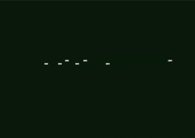

# Interactive Motion Prediction

This repository contains the implementation for Learning Interaction-aware Motion Prediction Model for Decision-making in Autonomous Driving. The work proposes an interaction-aware predictor to forecast neighboring agents' future trajectories conditioned on the ego vehicle's potential plans, integrated with a sampling-based planner for safe autonomous driving.

You can find the demos [HERE](https://ucsdcloud-my.sharepoint.com/:f:/g/personal/bradhakrishnan_ucsd_edu/Ev6XNkPQg-FHjCx_9x4zKe8BISpsEbspAwbDCX8hKfhbFw?e=bmHJYE)

# Framework Overview
The framework consists of two main components:

1. **Interaction Aware Predictor**: Forecasts neighboring agents' future trajectories based on the ego vehicle's potential plans

2. **Sampling Based Planner**: Performs collision checking and selects optimal trajectories considering distance to goal, ride comfort, and safety

# Decoder Architectures
The repository implements three different decoder architectures for trajectory prediction:

1. LSTM Decoder `(predictor.py)`
- Architecture: Long Short-Term Memory (LSTM) based decoder
- Implementation: Uses nn.LSTMCell with hidden size 384
- Features:
    - Handles long-term dependencies effectively
    - Maintains separate cell state and hidden state
    - Input size: 128 (with interaction) or 3 (without interaction)

2. GRU Decoder `(predictor_gru.py)`
- Architecture: Gated Recurrent Unit (GRU) based decoder
- Implementation: Uses nn.GRUCell with hidden size 384
- Features:
    - Simpler than LSTM with fewer parameters
    - Single hidden state (no separate cell state)
    - Faster training and inference

3. Transformer Decoder `(predictor_transformer.py)`
- Architecture: Transformer-based decoder with attention mechanisms
- Components:
    - Implementation: Uses nn.TransformerEncoder with hidden size 384
- Features:
    - Parallel processing capabilities
    - Attention-based interaction modeling
    - Better handling of long-range dependencies

# Key Features
Interaction-Aware Prediction
All decoders support interaction-aware prediction through:

1. Plan Input: Takes ego vehicle's planned trajectory as input
2. State Input: Considers current state of neighboring agents
3. Gate Mechanism: Controls the influence of ego vehicle's plan on predictions

## Training and Evaluation
#### Training Scenarios:
- `1_to_2lane_left_turn_c`
- `3lane_merge_single_agent`
- `3lane_overtake`

#### Metrics:
- ADE (Average Displacement Error): Average L2 distance over prediction horizon
- FDE (Final Displacement Error): L2 distance at final prediction step
- Success Rate: Percentage of episodes reaching the goal


# Results
You can view the Agent Vehicle (AV) performing the following 3 maneuvers:

### Unsignalized Intersection
<!--  -->


### Merge


### Overtake


# Setup and Installation
To get started with the model, follow these steps:

### 1. Running the Model
You can directly execute the `run.sh` script to train or test the model. Follow the instructions below to configure the script for each task:

- **For Training**: Uncomment **line 16** and comment out **line 17** in `run.sh`.
- **For Testing**: Uncomment **line 17** and comment out **line 16** in `run.sh`.

### 2. Setting Up the Decoder Type
The model supports multiple decoders, such as LSTM, GRU, and Transformer. To use a specific type of decoder, you must modify the `predictor.py` file.

- Rename the `predictor_{decoder_type}.py` file to `predictor.py` based on the decoder you wish to use.
  - For example, for an **LSTM-based decoder**, you can leave the `predictor.py` file as is (default).
  - For a **Transformer-based decoder**, rename `predictor_transformer.py` to `predictor.py`.

> **Note**: The default decoder is LSTM. You can switch to another type by following the renaming procedure described above.

### 3. Configuring for Testing
To ensure the model uses the same predictor for both training and testing:

- When running the model for testing, make sure to use the same predictor type as you did for training.
- Additionally, include the `--decoder {decoder_type}` flag in the testing command to specify the decoder type.

---

### Example Usage
If you want to use the **Transformer-based Decoder** for testing:

1. Rename the current `predictor.py` to `predictor_lstm.py` (since the default is LSTM).
2. Rename `predictor_transformer.py` to `predictor.py`.
3. Follow the instructions in Step 1 of the **Running the Model** section to execute the `run.sh` script.

This setup will allow you to run the model with the desired decoder type.


# Repository Structure
```
.
├── README.MD                           
├── docs/                              
│   └── merging.gif 
│   └── overtaking.gif
│   └── process.png
│   └── unsignalized_intersection.gif
├── models/                            
│   ├── gru_predictor_0.6672.pth      
│   ├── lstm_predictor_0.6651.pth     
│   └── transformer_1500epochs_predictor_0.6500.pth  
├── interaction_aware_predictor.pth    
├── observation.py                     
├── planner_utils.py                   
├── planner.py                         
├── predictor.py                       
├── predictor_gru.py                   
├── predictor_transformer.py          
├── train_utils.py                    
├── train.py                          
├── test.py                           
├── run.sh                            
├── smarts.sh                         
├── source_installations.sh           
└── start.sh                          
```

# References
[SMARTS](https://github.com/huawei-noah/SMARTS)
